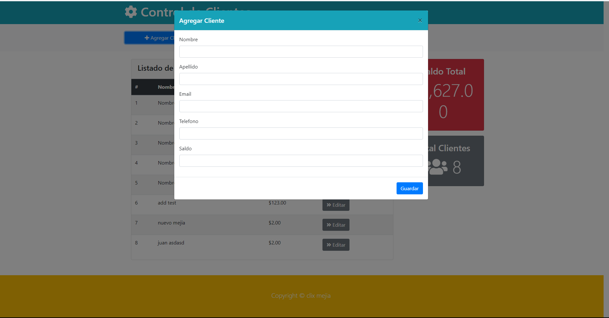
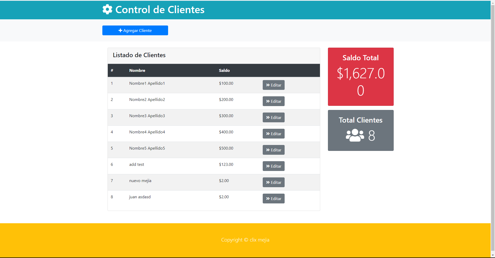

# Crud Customer | Clientes
-   es un proyecto de CRUD de clientes, donde se puede crear, leer, actualizar y eliminar clientes.
-    también muestra el total de clientes registrados  y el total de saldo de todos los clientes.
## Tecnologías
- java
- spring boot
- Thymeleaf
- bootstrap
- maven
- postgresql





## sql 
entrar a la caperta script

```
CREATE TABLE Cliente (
                         id_cliente INT PRIMARY KEY AUTO_INCREMENT,
                         nombre VARCHAR(255),
                         apellido VARCHAR(255),
                         email VARCHAR(255),
                         telefono VARCHAR(255),
                         saldo DOUBLE
);

```
